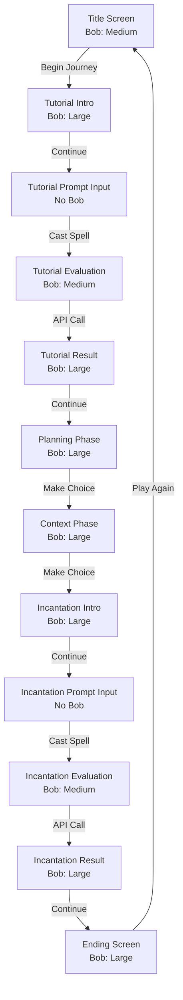

# PromptDojo UX Redesign Plan

## Problem Statement

Based on user testing feedback, the current single-screen approach creates confusion:
- All interactions crammed in bottom panel
- Dialogue and actions compete for attention
- No clear visual separation between game phases
- Missing proper introduction/title screen

## Design Principles

1. **One Purpose Per Screen**: Each screen should have a single, clear purpose
2. **Visual Hierarchy**: Important content (dialogue) should dominate the screen
3. **Clear CTAs**: Action buttons should be obvious and unambiguous
4. **Progressive Disclosure**: Show only what's needed at each step
5. **Spatial Consistency**: Similar elements should appear in consistent locations
6. **Character Presence**: Bob mascot appears prominently when he's speaking

## Screen Architecture

### 1. Title Screen
**Purpose**: Welcome player and set the tone

**Layout**:
```
┌─────────────────────────────────────┐
│                                     │
│      PROMPTDOJO                     │
│   (Large gradient title)            │
│                                     │
│  "The Architect's Awakening"        │
│                                     │
│         [Bob Mascot SVG]            │
│        (Medium size)                │
│                                     │
│                                     │
│   [▶ Begin Your Journey]            │
│                                     │
└─────────────────────────────────────┘
```

**Elements**:
- Large, prominent game title with gradient
- Subtitle: "The Architect's Awakening"
- Bob mascot centered (medium size)
- Single primary CTA: "Begin Your Journey"
- Dark cyber background with subtle animations

---

### 2. Story Screen (Narrative Phases)
**Purpose**: Display dialogue with character presence

**Layout - When Archmage Bob is speaking**:
```
┌─────────────────────────────────────┐
│ MANA: 1000/1000                     │ ← Compact HUD
├─────────────────────────────────────┤
│                                     │
│                                     │
│        [LARGE BOB MASCOT]           │ ← Behind dialogue
│         (Background)                │
│                                     │
│  ┌─────────────────────────────┐   │
│  │ [NARRATOR Badge]            │   │
│  │                             │   │
│  │ "Welcome, apprentice.       │   │ ← Dialogue box
│  │  You stand before the       │   │   overlays Bob
│  │  Scrying Terminal..."       │   │
│  │                             │   │
│  └─────────────────────────────┘   │
│                                     │
├─────────────────────────────────────┤
│                                     │
│    [Choice Button 1]                │ ← Action buttons
│    [Choice Button 2]                │   below dialogue
│    [Choice Button 3]                │
│                                     │
└─────────────────────────────────────┘
```

**Layout - When Narrator is speaking**:
```
┌─────────────────────────────────────┐
│ MANA: 1000/1000                     │
├─────────────────────────────────────┤
│                                     │
│     [Cyber Background]              │ ← No Bob mascot
│                                     │
│  ┌─────────────────────────────┐   │
│  │ [NARRATOR Badge]            │   │
│  │                             │   │
│  │ "You approach the ancient   │   │
│  │  terminal, its screens      │   │
│  │  flickering with power..."  │   │
│  │                             │   │
│  └─────────────────────────────┘   │
│                                     │
├─────────────────────────────────────┤
│                                     │
│         [Continue →]                │
│                                     │
└─────────────────────────────────────┘
```

**Visual Hierarchy**:
1. **Bob Mascot** (when speaking): Large, centered, behind dialogue (~60% screen height)
2. **Dialogue Box**: Semi-transparent overlay on Bob, centered (~40% screen height)
3. **Speaker Badge**: "NARRATOR" or "ARCHMAGE BOB" at top of dialogue box
4. **Action Buttons**: Below dialogue, clear spacing

**Elements**:
- Compact HUD at top (mana bar only)
- Large Bob mascot SVG (when Archmage Bob speaks)
- Dialogue box with semi-transparent background
- Speaker identification badge
- Action buttons at bottom (max 3 choices or 1 continue)
- Typewriter animation for dialogue
- Cyber background visible when narrator speaks

**Used For**:
- Tutorial introduction (Bob speaks)
- Planning phase choices (Bob speaks)
- Context phase choices (Bob speaks)
- Transition dialogues (Narrator speaks)

---

### 3. Prompt Input Screen
**Purpose**: Collect user's prompt for evaluation

**Layout**:
```
┌─────────────────────────────────────┐
│ MANA: 200/1000                      │
├─────────────────────────────────────┤
│                                     │
│  [Instruction Text]                 │
│  "Now, craft your incantation..."   │
│                                     │
│  ┌───────────────────────────────┐ │
│  │ [THE SCRYING TERMINAL]        │ │
│  │                               │ │
│  │ [Large Text Input Area]       │ │
│  │                               │ │
│  │ Type your prompt here...      │ │
│  │                               │ │
│  │                               │ │
│  └───────────────────────────────┘ │
│                                     │
│  💡 Tip: Include role, tech stack,  │
│     constraints, and context        │
│                                     │
│  Character count: 0/500             │
│                                     │
│    [✨ Cast Spell]                  │
│                                     │
└─────────────────────────────────────┘
```

**Elements**:
- Clear instruction text
- Large, prominent text input (multiline)
- "THE SCRYING TERMINAL" header
- Helpful tips below input
- Character counter
- Single primary action: "Cast Spell"
- No Bob mascot (focus on input)

**Used For**:
- Tutorial forced prompt
- Incantation phase user input

---

### 4. Evaluation Screen
**Purpose**: Show loading state during API call

**Layout**:
```
┌─────────────────────────────────────┐
│ MANA: 200/1000                      │
├─────────────────────────────────────┤
│                                     │
│                                     │
│         [Bob Mascot]                │
│      (Medium, centered)             │
│                                     │
│     [Animated Spinner/Glow]         │
│                                     │
│  "Archmage Bob is evaluating        │
│   your spell..."                    │
│                                     │
│  "This may take a few moments"      │
│                                     │
│                                     │
└─────────────────────────────────────┘
```

**Elements**:
- Bob mascot with animated glow effect
- Loading spinner or pulse animation
- Status text
- No interactive elements (loading state)

---

### 5. Result Screen
**Purpose**: Display evaluation feedback with Bob's presence

**Layout**:
```
┌─────────────────────────────────────┐
│ MANA: 200→80 [-120] (animated)     │
├─────────────────────────────────────┤
│                                     │
│        [LARGE BOB MASCOT]           │ ← Bob appears
│         (Background)                │   for feedback
│                                     │
│  ┌─────────────────────────────┐   │
│  │ [ARCHMAGE BOB Badge]        │   │
│  │                             │   │
│  │ "Your spell lacks focus,    │   │
│  │  apprentice. The artifact   │   │
│  │  demands precision..."      │   │
│  │                             │   │
│  │ Quality Score: 7/10         │   │
│  │ Mana Cost: -120             │   │
│  └─────────────────────────────┘   │
│                                     │
├─────────────────────────────────────┤
│                                     │
│    [Continue to Next Phase →]      │
│                                     │
└─────────────────────────────────────┘
```

**Elements**:
- Large Bob mascot behind dialogue
- Animated mana bar change (with color flash)
- Bob's character feedback in dialogue box
- Score breakdown in dialogue
- Clear next action button

**Used For**:
- Tutorial result
- Incantation result

---

### 6. Ending Screen
**Purpose**: Show final outcome with Bob's presence

**Layout - Good Ending**:
```
┌─────────────────────────────────────┐
│ FINAL MANA: 150/1000                │
├─────────────────────────────────────┤
│                                     │
│        [LARGE BOB MASCOT]           │
│      (Triumphant pose)              │
│                                     │
│  ┌─────────────────────────────┐   │
│  │ "The Architect's Triumph"   │   │
│  │                             │   │
│  │ "Through careful planning   │   │
│  │  and precise incantations,  │   │
│  │  you have mastered..."      │   │
│  │                             │   │
│  │ Your Journey:               │   │
│  │ • Blueprint: Acquired       │   │
│  │ • Context: Comprehensive    │   │
│  │ • Final Score: 8/10         │   │
│  └─────────────────────────────┘   │
│                                     │
├─────────────────────────────────────┤
│         [🔄 Play Again]             │
└─────────────────────────────────────┘
```

**Layout - Bad Ending**:
```
┌─────────────────────────────────────┐
│ FINAL MANA: -300/1000               │
├─────────────────────────────────────┤
│                                     │
│        [LARGE BOB MASCOT]           │
│       (Disappointed)                │
│                                     │
│  ┌─────────────────────────────┐   │
│  │ "Mana Depleted"             │   │
│  │                             │   │
│  │ "Your hasty incantations    │   │
│  │  have drained your mana     │   │
│  │  reserves completely..."    │   │
│  │                             │   │
│  │ What went wrong:            │   │
│  │ • No planning blueprint     │   │
│  │ • Insufficient context      │   │
│  │ • Vague prompt              │   │
│  └─────────────────────────────┘   │
│                                     │
├─────────────────────────────────────┤
│         [🔄 Try Again]              │
└─────────────────────────────────────┘
```

**Elements**:
- Large Bob mascot (expression matches ending)
- Ending title
- Narrative conclusion in dialogue box
- Journey summary
- Replay button

---

## Bob Mascot Implementation Details

### When to Show Bob:
- ✅ **Title Screen**: Medium size, centered
- ✅ **Story Screen**: Large, behind dialogue (when Archmage Bob speaks)
- ❌ **Story Screen**: Hidden (when Narrator speaks)
- ❌ **Prompt Input Screen**: Hidden (focus on input)
- ✅ **Evaluation Screen**: Medium size with animation
- ✅ **Result Screen**: Large, behind dialogue
- ✅ **Ending Screen**: Large, behind dialogue

### Size Guidelines:
- **Large**: ~60-70% of screen height (behind dialogue)
- **Medium**: ~40-50% of screen height (standalone)
- **Small**: Not used in this design

### Visual Treatment:
- Bob SVG loaded from `assets/images/bob_mascot.svg`
- Positioned behind dialogue box (z-index lower)
- Slight opacity (0.9) when behind dialogue for depth
- Full opacity (1.0) when standalone
- Optional subtle animation (gentle float/pulse)

### Dialogue Box Over Bob:
- Semi-transparent background (rgba with 0.85-0.95 alpha)
- Blur effect on background (backdrop-filter if supported)
- Clear border to separate from Bob
- Centered horizontally
- Positioned in middle-to-lower third of screen

---

## Navigation Flow



## Screen Transitions

All screen transitions should use:
- **Fade transition** (300ms) for smooth flow
- **Slide transition** (400ms) for forward/back navigation
- **Scale animation** for button presses (150ms)
- **Bob entrance**: Fade + slight scale (500ms) when appearing

## Responsive Behavior

### Mobile (Primary Target)
- Full-screen layouts
- Large touch targets (min 48x48dp)
- Readable text (min 16sp for body, 14sp for dialogue)
- Bob scales proportionally to screen size
- Adequate spacing between interactive elements

### Web (Secondary)
- Max width: 600px (centered)
- Maintain mobile-first proportions
- Keyboard navigation support
- Bob maintains aspect ratio

## Implementation Strategy

### Phase 1: Core Components
1. Create `BobMascot` widget (handles SVG loading, sizing, animations)
2. Create `DialogueOverlay` widget (semi-transparent box over Bob)
3. Create `StoryLayout` widget (combines Bob + Dialogue + Buttons)

### Phase 2: Screen Components
1. Create `TitleScreen` widget
2. Create `StoryScreen` widget (replaces current GameScreen)
3. Create `PromptInputScreen` widget
4. Create `EvaluationScreen` widget
5. Create `ResultScreen` widget
6. Create `EndingScreen` widget

### Phase 3: Navigation
1. Implement screen routing (Navigator 2.0 or simple push/pop)
2. Add transition animations
3. Handle back button behavior
4. Add Bob entrance/exit animations

### Phase 4: State Management
1. Update GameController to work with multi-screen flow
2. Add screen state tracking
3. Implement navigation logic in controller
4. Track Bob visibility state

### Phase 5: Polish
1. Add screen-specific animations
2. Implement Bob animations (float, pulse, glow)
3. Add sound effects for transitions
4. Test complete flow
5. Optimize Bob SVG rendering

## Technical Notes

### Bob SVG Rendering
```dart
// Load Bob mascot
SvgPicture.asset(
  'assets/images/bob_mascot.svg',
  height: screenHeight * 0.6, // Large size
  fit: BoxFit.contain,
  colorFilter: ColorFilter.mode(
    Colors.white.withOpacity(0.9), // Slight transparency
    BlendMode.dstIn,
  ),
)
```

### Dialogue Overlay
```dart
// Semi-transparent dialogue box
Container(
  decoration: BoxDecoration(
    color: AppTheme.surfaceColor.withOpacity(0.9),
    borderRadius: BorderRadius.circular(12),
    border: Border.all(
      color: AppTheme.primaryColor.withOpacity(0.5),
      width: 2,
    ),
    boxShadow: [
      BoxShadow(
        color: Colors.black.withOpacity(0.5),
        blurRadius: 20,
        offset: Offset(0, 4),
      ),
    ],
  ),
  // Dialogue content
)
```

## Success Metrics

After redesign, the UX should achieve:
- ✅ Clear purpose for each screen
- ✅ No confusion about what to do next
- ✅ Dialogue is prominent and readable
- ✅ Bob's presence enhances character connection
- ✅ Actions are obvious and accessible
- ✅ Smooth flow between phases
- ✅ Professional, polished feel
- ✅ Strong visual identity with Bob mascot

## Next Steps

1. ✅ Get approval on this UX design
2. Create BobMascot and DialogueOverlay components
3. Implement TitleScreen
4. Implement StoryScreen with Bob integration
5. Test Bob visibility logic
6. Implement remaining screens
7. Add animations and polish
8. Gather feedback and iterate